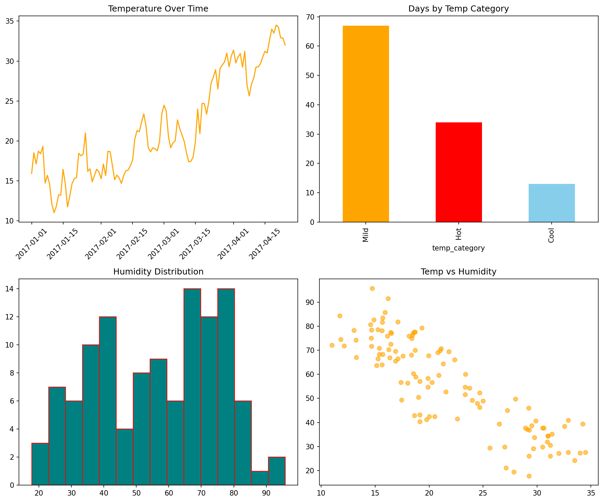

# Delhi Weather Data Analysis (Jan-Apr 2017)

A data analysis project exploring temperature, humidity, and pressure trends in Delhi using Python, pandas, and Matplotlib.

## Overview
Analysis of Daily Climate Data for Delhi covering January–April 2017, exploring temperature, humidity, wind speed, and pressure trends.

## Key Insights
- Temperature rose from ~11°C in January to ~33°C by late April.
- Temperature and humidity show a strong negative correlation (-0.86).
- Atmospheric pressure fell as temperatures rose (-0.87 correlation).
- 67 days were "Mild," 34 "Hot," 13 "Cool" based on temperature category.
- The five hottest days were also among the five driest.

## Visualizations

## Tools Used
Python, Pandas, NumPy, Matplotlib, Jupyter Notebook

## Dataset
Daily Climate Time Series Data (Delhi), sourced from Kaggle.